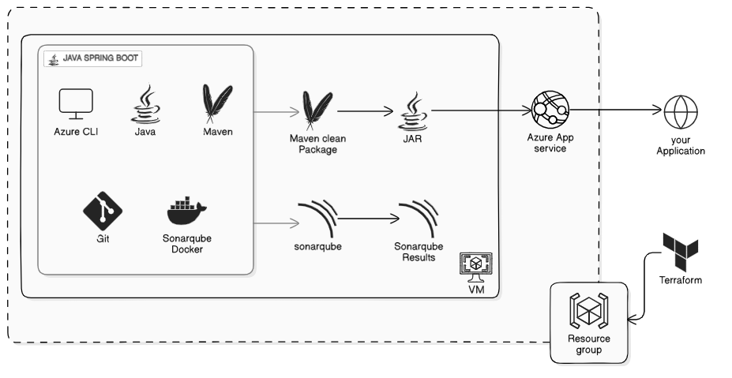

# Spring Petclinic on Azure with Terraform & SonarQube

This project demonstrates deploying the [Spring Petclinic](https://github.com/spring-projects/spring-petclinic) Java application on **Azure App Service**, with infrastructure managed by **Terraform** and code quality validated using **SonarQube**.

---

## Project Highlights
- **Infrastructure as Code**: Provisioned Azure resources (VM, App Service, networking) using Terraform.
- **SonarQube Analysis**: Set up SonarQube in Docker on an Azure VM, generated project key & token, and ran static code analysis with Maven.
- **Java Deployment**: Built the Petclinic JAR and deployed it to Azure App Service (Java 17).
- **Security**: Hardened NSG rules and avoided committing sensitive values (`terraform.tfvars`, tokens) into version control.

---

## Tech Stack
- **Terraform** — AzureRM provider
- **Azure App Service (Linux, Java 17)**
- **Azure Virtual Machine (Ubuntu)**
- **SonarQube** (Docker container)
- **Spring Boot** — Petclinic demo app
- **Maven** — Build automation
- **Azure CLI**

---

## Architecture
```plaintext
Terraform → Azure VM (SonarQube in Docker)
          → Azure App Service (Java 17, hosts Petclinic)
          → Azure Networking (VNet, Subnet, NSG)

```
----
## Architecture Diagram



## How to Reproduce

1. Clone & Configure
```plaintext
    git clone https://github.com/ravi-on-cloud/spring-petclinic-azure-terraform.git
    cd spring-petclinic-azure-terraform

    # Initialize terraform
    terraform init

    # Apply resources
    terraform apply
```

2. SonarQube Setup (on Azure VM)

    SSH into the VM, install Docker, Java, Maven, and Azure CLI.

    Run SonarQube in Docker:
```
    docker run -d --name sonarqube -p 9000:9000 sonarqube:lts-community
```

    Access http://<vm-public-ip>:9000, change the default password, and create a project key and token.

3. Build & Analyze Petclinic
```
    git clone https://github.com/spring-projects/spring-petclinic
    cd spring-petclinic
    mvn -DskipTests=true clean package
```

## Run Sonar analysis (twice to populate trends)
Run this code
```
 mvn -DskipTests=true clean verify sonar:sonar \
  -Dsonar.host.url=http://<vm-public-ip>:9000 \
  -Dsonar.projectKey=<project-key> \
  -Dsonar.token=<your-token>
```

4. Deploy to Azure App Service

    From your local machine:
```
    az webapp deploy \
    --resource-group proj6-app-rg \
    --name proj6-petclinic-app \
    --src-path app.jar \
    --type jar
```

## Notes

Restricted inbound SSH to my IP once setup was complete.

Secrets (terraform.tfvars, Sonar tokens) are excluded from version control via .gitignore.

Using Terraform outputs to fetch app name & URL for convenience.


GitHub Topics

terraform · azure · java · spring-boot · sonarqube · devops · cloud · IAC

